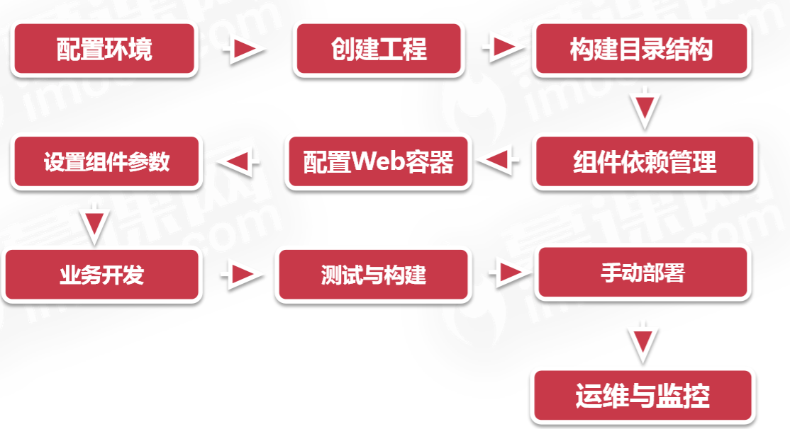
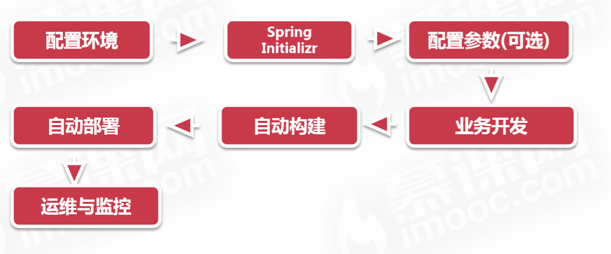
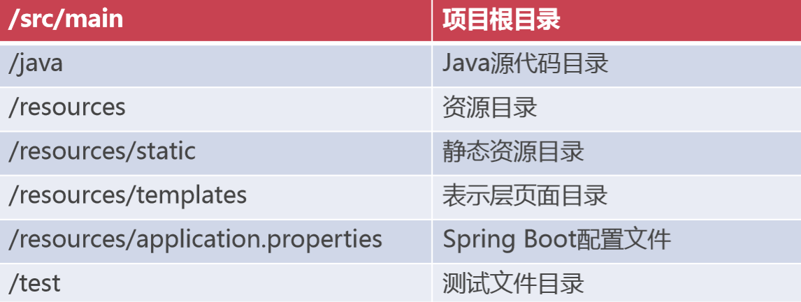
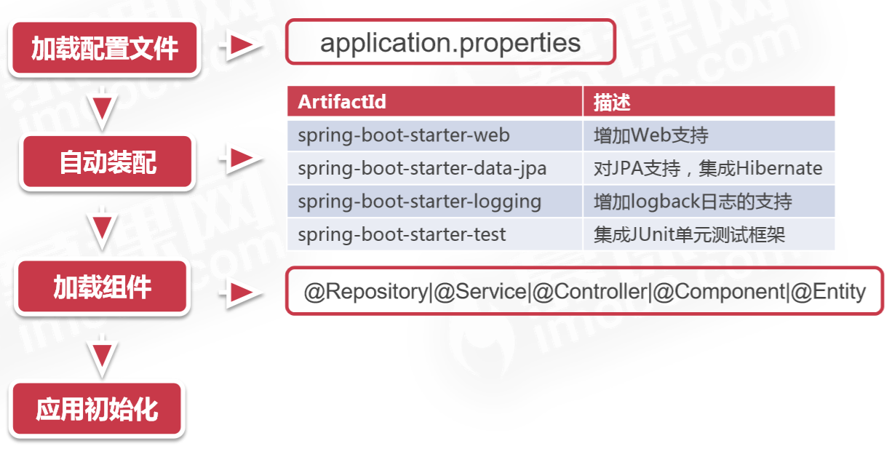
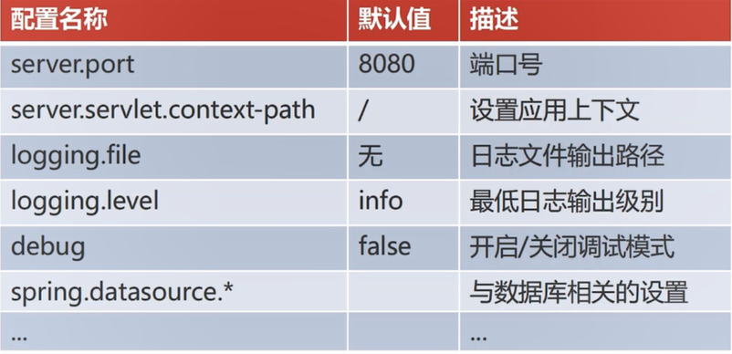
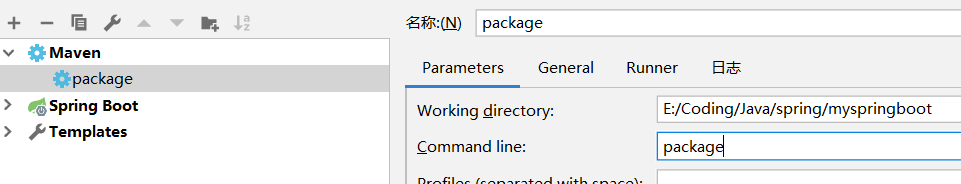

### SpringBoot基础


**与Spring对比**

spring应用开发流程


springBoot开发流程




**特性**

* 简单
* 可独立运行的Spring项目
* 习惯优于配置的，极大提高了开发效率：只需有jdk8以上版本，无需手动配置tomcat，会自动内嵌到工程中
* 极简的组件依赖，自动发现与自动装配：只要maven里导入了，SpringBoot就能发现，并自动配置
* 提供运行时的应用监控
* 与分布式架构和云计算的天然集成

**spring boot 目录结构**





**基本项目搭建**

1. 创建普通maven项目
1. 构建目录结构
1. 组件依赖 ： `spring-boot-starter-parent` 

```
<parent>
    <groupId>org.springframework.boot</groupId>
    <artifactId>spring-boot-starter-parent</artifactId>
    <version>2.0.1.RELEASE</version>
</parent>
```

4. Dependencies  : `spring-boot-starter-web` 

```
<dependencies>
    <dependency>
        <groupId>org.springframework.boot</groupId>
        <artifactId>spring-boot-starter-web</artifactId>
    </dependency>
</dependencies>
```

5. 定义打包方式  ：帮助我们在进行打包时自动将所有的类和资源整合成一个独立的可运行的jar包

```
<build>
    <plugins>
        <plugin>
            <groupId>org.springframework.boot</groupId>
            <artifactId>spring-boot-maven-plugin</artifactId>
        </plugin>
    </plugins>
</build>
```
6. 写入口类 ,用 `@SpringBootApplication` 注解

```
package com.njupt.myspringboot;

import org.springframework.boot.SpringApplication;
import org.springframework.boot.autoconfigure.SpringBootApplication;

//入口类
@SpringBootApplication
public class MyspringbootApplication {

    public static void main(String[] args) {
        SpringApplication.run(MyspringbootApplication.class, args);
    }
}
```
然后右击运行这个类就可以启动了

只要像spring mvc那样写一个Controller，配置路由，就可以通过默认的8080端口访问


**简单版**

第一种：使用官方地址生成项目 :`https://start.spring.io`   可以在这里面有生成项目然后下载到本地。

第二种：idea创建项目时选择 `Spring Initializr` ，会自动帮我们生成目录和完成基础配置


**Spring Boot 入口类**

* 入口类命名通常以 *Application结尾
* 入口类上增加  `@SpringBootApplication` 注解
* 利用 `SpringApplication.run()`  方法启动引用

**Spring Boot 启动流程**



应用初始化包括：tomcat，初始化日志，初始化数据源，初始化数据库连接源 等


**Spring Boot 中的常用的配置**

> 写在application.properties 里面, 它是springBoot的核心配置文件



* **server.servlet.context-path**当tomcat中有多个不同的应用，就需要设置上下文，` server.servlet.contex-path=/上下文名称(项目名)`

        这样在访问时要加上context-path ：localhost/xxx/

* 可以通过loggin.file 将日志输出到一个文件
* logging.level ：  `debug >info >warn >error >fatal  `     错误级别依次提高
* spring.datasource._      后面可以跟 _**_url，username，passwor，dirver\-class\-name_**


**Spring Boot 支持两种配置方式**

1. 属性文件：application.properties
1. YAML格式：application.yml

_YAML语法_

* key:(空格)value
* 使用空格代表层级关系，以":"结束


```
debuge: true
logging:
  level:
   root: info
  file: e:/myTemp/myspringboot.log

spring:
  datasource:
    driver-class-name: com.mysql.jdbc.Driver
    url: jdbc:mysql://localhost:3306/test
    username: root
    password: root


#   自定义属性
mall:
  config:
    name: 爱美商城
    description: 这是一家化妆品特卖网站
    hot-sales: 20
    show-advert: true
```


Spring Boot 允许我们自定义引用配置项，在程序运行时允许动态加载，这为程序提供了良好的可维护性在实际项目开发中，我们通常将项目的自定义信息放在配置文件中  \(如上面的mall.config\),这样在单例中就可以通过  `@Value("${}")`  进行属性注入


项目开发过程中会有多个环境，如开发环境，生产环境，他们的配置会有差异，如果只有一个环境配置，在切换环境的时候就要来回修改配置文件，很不方便。


* Spring Boot可针对不同的环境提供不同的 Profile(环境配置)文件
* Profile文件的默认命名格式为  `application-{env}.yml`  ,{env}用具体的一种环境名字代替
* 然后在主配置文件 `application.yml` 中用spring.profiles.active来指定现在用哪个环境

```
```
spring:
  profiles:
    active: dev      #指用的是 application-dev.yml 配置文件中配置的环境``````


**打包与运行**

 1. 利用Maven的package命令，生成可独立运行的jar包 

      idea快捷方式，编辑配置，+maven，配置打包的快捷按钮





2. cmd 下  `java -jar xxx.jar `   命令启动Spring Boot应用  (jar文件是打包好的SpringBoot应用\)

3. 如果向修改运行环境，只需要将yml / properties配置文件放在相同目录下，jar包就可以自动加载同目录的application配置文件


